# 🤖 CodeAuditAI (Code Reviewer & Executor)

<div align="center">


**Transform Your Code with AI-Powered Reviews & Real-Time Execution**

[](https://reactjs.org/)
[](https://nodejs.org/)
[](https://expressjs.com/)
[](https://ai.google.dev/)
[](https://piston.readthedocs.io/)

</div>

## 📋 Project Description

This project is a comprehensive web-based code reviewer and executor application that leverages AI to provide feedback on code while also allowing real-time code execution. It consists of a React frontend and a Node.js backend, offering intelligent code analysis, review capabilities powered by Google's Gemini AI, and code execution through the Piston API.

## ✨ Features

- 🔍 **AI-powered code analysis and review**
- ⚡ **Real-time code execution with output display**
- 🌐 **Support for multiple programming languages**
- 💻 **User-friendly interface for submitting, reviewing, and executing code**
- 🎨 **Modern, responsive design**
- 🚀 **Instant feedback on code quality and functionality**
- 📊 **Execution results with error handling**

## 🛠️ Technologies Used

### Frontend
<table>
<tr>
<td align="center">

<br><strong>React</strong>
<br><em>UI Library</em>
</td>
<td align="center">

<br><strong>Vite</strong>
<br><em>Build Tool</em>
</td>
<td align="center">

<br><strong>Lucide React</strong>
<br><em>Icons</em>
</td>
</tr>
<tr>
<td align="center">

<br><strong>Monaco Editor</strong>
<br><em>Code Editor</em>
</td>
<td align="center">

<br><strong>Axios</strong>
<br><em>HTTP Client</em>
</td>
<td align="center">

<br><strong>Piston API</strong>
<br><em>Code Execution</em>
</td>
<td></td>
</tr>
</table>

### Backend
<table>
<tr>
<td align="center">

<br><strong>Node.js</strong>
<br><em>Runtime</em>
</td>
<td align="center">

<br><strong>Express.js</strong>
<br><em>Web Framework</em>
</td>
<td align="center">

<br><strong>Google Gemini AI</strong>
<br><em>AI Engine</em>
</td>
<td align="center">

<br><strong>Axios</strong>
<br><em>HTTP Client</em>
</td>
</tr>
</table>

## 🚀 Setup Instructions

### Prerequisites

- 
- 

### 🔧 Backend Setup

1. **Navigate to the backend directory:**
   ```bash
   cd backend
   ```

2. **Install dependencies:**
   ```bash
   npm install
   ```

3. **Start the backend server:**
   ```bash
   node server.js
   # Or using nodemon for development
   # npm install -g nodemon
   # nodemon server.js
   ```

### 💻 Frontend Setup

1. **Open a new terminal and navigate to the frontend directory:**
   ```bash
   cd frontend
   ```

2. **Install dependencies:**
   ```bash
   npm install
   ```

3. **Start the development server:**
   ```bash
   npm run dev
   ```

### 🌐 Access the Application

Once both servers are running, open your browser and navigate to:
```
http://localhost:5173/
```

## 📁 Project Structure

```
📦 Code Reviewer & Executor
├── 📄 README.md
├── 📂 backend/
│   ├── 🚫 .gitignore
│   ├── 🎛️ controllers/             # Handles AI review logic
│   │   └── AI.controllers.js
│   ├── 🔒 package-lock.json
│   ├── 📦 package.json
│   ├── 🛣️ routes/                  # Defines API routes
│   │   └── Ai.routes.js
│   ├── 🖥️ server.js                # Main backend server file
│   └── 🔧 services/                # Contains AI service logic
│       ├── AI.services.js
│       └── systemInstruction.md
└── 📂 frontend/
    ├── 🚫 .gitignore
    ├── 📄 README.md
    ├── ⚙️ eslint.config.js
    ├── 🌐 index.html
    ├── 🔒 package-lock.json
    ├── 📦 package.json
    ├── 📁 public/
    │   └── vite.svg
    ├── 📁 src/
    │   ├── 🎨 App.css
    │   ├── ⚛️ App.jsx              # Main application component
    │   ├── 📁 assets/              # Static assets
    │   ├── 🧩 components/          # Reusable UI components
    │   ├── 🔄 context/             # React context for global state
    │   ├── 📄 constants.js         # Language versions and configurations
    │   ├── ⚡ executeCode.js       # Piston API integration for code execution
    │   └── 🚀 main.jsx             # Entry point
    └── ⚙️ vite.config.js
```

## 🔌 API Usage and Workflow

### AI Review API Endpoint

**Endpoint:** `POST /ai/check`

**Request Body:**
```json
{
  "code": "// Your code here\nfunction greet() { console.log('Hello'); }",
  "language": "javascript"
}
```

**Response Body:**
```json
{
  "review": "The code is well-structured. Consider adding comments for complex logic."
}
```

### Code Execution Integration

This application includes a powerful code execution feature utilizing the **Piston API**.

- ⚙️ **Piston API**: A free, open-source code execution engine supporting multiple programming languages such as JavaScript, Python, C++, and more.
- 📡 **HTTP API**: Executes code on the server through a simple HTTP API at the `/execute` endpoint.
- 📦 **Axios Integration**: Use Axios to send source code, programming language, and file details in a POST request.
- 📂 **Response Output**: The API returns output, errors, and status, making it ideal for compilers or code playgrounds.
- 🚫 **HTML/CSS Handling**: Skips execution for HTML and CSS files, displaying an appropriate message instead.

#### Why Use It

This integration is perfect for building online IDEs, coding applications, AI code reviewers, or learning platforms.

### 🔄 Enhanced Workflow

```mermaid
graph TD
    A[👤 User Input] --> B[📝 Code Entry]
    B --> C{🤔 User Choice}
    C -->|Review| D[🤖 AI Review Path]
    C -->|Execute| E[⚡ Code Execution Path]
    D --> F[🧠 Gemini AI Analysis]
    E --> G[🔧 Piston API Execution]
    F --> H[📤 Review Results]
    G --> I[📊 Execution Output]
    H --> J[💻 Display Results]
    I --> J
```



**Supported Languages for Execution:**
- ✅ JavaScript/Node.js
- ✅ TypeScript
- ✅ Python
- ✅ Java
- ✅ C/C++
- ⚠️ HTML/CSS (Display only - markup languages)

## 🌟 Real-Life Use Cases

<table>
<tr>
<td align="center">
<h3>👨‍💻 Individual Developers</h3>
Get instant feedback on code quality, test code functionality, and learn from AI suggestions
</td>
<td align="center">
<h3>🎓 Learning & Education</h3>
Students can write, execute, and review code in one place while learning from mistakes
</td>
</tr>
<tr>
<td align="center">
<h3>👥 Code Interviews</h3>
Practice coding problems with immediate execution and AI-powered feedback
</td>
<td align="center">
<h3>🔧 Rapid Prototyping</h3>
Quickly test code snippets and algorithms with instant execution results
</td>
</tr>
<tr>
<td align="center">
<h3>🚀 Algorithm Testing</h3>
Validate algorithm correctness and performance with execution output
</td>
<td align="center">
<h3>📚 Code Documentation</h3>
Generate examples with working code that can be executed and reviewed
</td>
</tr>
</table>

## 🎯 Key Features

### 🤖 AI-Powered Code Review
- Intelligent analysis using Google Gemini AI
- Best practices suggestions
- Code quality assessment
- Security vulnerability detection

### ⚡ Real-Time Code Execution
- Support for 8+ programming languages
- Instant output display
- Error handling and debugging assistance
- Performance metrics

### 🎨 User Experience
- Monaco Editor integration for professional coding experience
- Syntax highlighting for all supported languages
- Responsive design for desktop and mobile
- Multi-language support with i18n

## 📸 Screenshots

<div align="center">

### 🏠 Landing Page

### 💻 Code Editor with Execution


### 🤖 AI Review Results


</div>

## 🤝 Contributing

Contributions are welcome! Please feel free to submit a Pull Request.

1. Fork the project
2. Create your feature branch (`git checkout -b feature/AmazingFeature`)
3. Commit your changes (`git commit -m 'Add some AmazingFeature'`)
4. Push to the branch (`git push origin feature/AmazingFeature`)
5. Open a Pull Request


## 🙏 Acknowledgments

- Google Gemini AI for providing powerful code analysis capabilities
- Piston API for enabling seamless code execution in multiple languages
- Monaco Editor team for the excellent web-based code editor
- React and Node.js communities for their amazing tools and documentation

---

<div align="center">

**Made with ❤️ by Ayesha Shaw**

[](https://github.com/ayeshashaw)
[](https://www.linkedin.com/in/ayesha-shaw)

</div>
