# 🤖 Code Reviewer

<div align="center">


**Transform Your Code with AI-Powered Reviews**

[](https://reactjs.org/)
[](https://nodejs.org/)
[](https://expressjs.com/)
[](https://ai.google.dev/)

</div>

## 📋 Project Description

This project is a web-based code reviewer application that leverages AI to provide feedback on code. It consists of a React frontend and a Node.js backend, offering intelligent code analysis and review capabilities powered by Google's Gemini AI.

## ✨ Features

- 🔍 **AI-powered code analysis and review**
- 🌐 **Support for multiple programming languages**
- 💻 **User-friendly interface for submitting and reviewing code**
- ⚡ **Real-time code feedback**
- 🎨 **Modern, responsive design**

## 🛠️ Technologies Used

### Frontend
<table>
<tr>
<td align="center">

<br><strong>React</strong>
<br><em>UI Library</em>
</td>
<td align="center">

<br><strong>Chakra UI</strong>
<br><em>Component Library</em>
</td>
<td align="center">

<br><strong>Vite</strong>
<br><em>Build Tool</em>
</td>
<td align="center">

<br><strong>Lucide React</strong>
<br><em>Icons</em>
</td>
</tr>
<tr>
<td align="center">

<br><strong>React i18next</strong>
<br><em>Internationalization</em>
</td>
<td align="center">

<br><strong>Monaco Editor</strong>
<br><em>Code Editor</em>
</td>
<td align="center">

<br><strong>Axios</strong>
<br><em>HTTP Client</em>
</td>
<td></td>
</tr>
</table>

### Backend
<table>
<tr>
<td align="center">

<br><strong>Node.js</strong>
<br><em>Runtime</em>
</td>
<td align="center">

<br><strong>Express.js</strong>
<br><em>Web Framework</em>
</td>
<td align="center">

<br><strong>Google Gemini AI</strong>
<br><em>AI Engine</em>
</td>
<td align="center">

<br><strong>Axios</strong>
<br><em>HTTP Client</em>
</td>
</tr>
</table>

## 🚀 Setup Instructions

### Prerequisites

- 
- 

### 🔧 Backend Setup

1. **Navigate to the backend directory:**
   ```bash
   cd backend
   ```

2. **Install dependencies:**
   ```bash
   npm install
   ```

3. **Start the backend server:**
   ```bash
   node server.js
   # Or using nodemon for development
   # npm install -g nodemon
   # nodemon server.js
   ```

### 💻 Frontend Setup

1. **Open a new terminal and navigate to the frontend directory:**
   ```bash
   cd frontend
   ```

2. **Install dependencies:**
   ```bash
   npm install
   ```

3. **Start the development server:**
   ```bash
   npm run dev
   ```

### 🌐 Access the Application

Once both servers are running, open your browser and navigate to:
```
http://localhost:5173/
```

## 📁 Project Structure

```
📦 Code Reviewer
├── 📄 README.md
├── 📂 backend/
│   ├── 🚫 .gitignore
│   ├── 🎛️ controllers/             # Handles AI review logic
│   │   └── AI.controllers.js
│   ├── 🔒 package-lock.json
│   ├── 📦 package.json
│   ├── 🛣️ routes/                  # Defines API routes
│   │   └── Ai.routes.js
│   ├── 🖥️ server.js                # Main backend server file
│   └── 🔧 services/                # Contains AI service logic
│       ├── AI.services.js
│       └── systemInstruction.md
└── 📂 frontend/
    ├── 🚫 .gitignore
    ├── 📄 README.md
    ├── ⚙️ eslint.config.js
    ├── 🌐 index.html
    ├── 🔒 package-lock.json
    ├── 📦 package.json
    ├── 📁 public/
    │   └── vite.svg
    ├── 📁 src/
    │   ├── 🎨 App.css
    │   ├── ⚛️ App.jsx              # Main application component
    │   ├── 📁 assets/              # Static assets
    │   ├── 🧩 components/          # Reusable UI components
    │   ├── 🔄 context/             # React context for global state
    │   └── 🚀 main.jsx             # Entry point
    └── ⚙️ vite.config.js
```

## 🔌 API Usage and Workflow

### AI Review API Endpoint

**Endpoint:** `POST /ai/check`

**Request Body:**
```json
{
  "code": "// Your code here\nfunction greet() { console.log('Hello'); }",
  "language": "javascript"
}
```

**Response Body:**
```json
{
  "review": "The code is well-structured. Consider adding comments for complex logic."
}
```

### 🔄 Workflow

```mermaid
graph TD
    A[👤 User Input] --> B[📝 Frontend Request]
    B --> C[🔧 Backend Processing]
    C --> D[🤖 AI Service Interaction]
    D --> E[🧠 Gemini AI Review]
    E --> F[📤 Backend Response]
    F --> G[💻 Frontend Display]
```



1. **👤 User Input:** User enters code in Monaco Editor and selects language
2. **📝 Frontend Request:** POST request sent to `/ai/check` endpoint
3. **🔧 Backend Processing:** Request routed to `AI.controllers.js`
4. **🤖 AI Service Interaction:** Controller calls `AI.services.js`
5. **🧠 Gemini AI Review:** AI analyzes code using system instructions
6. **📤 Backend Response:** AI review sent back to frontend
7. **💻 Frontend Display:** Review displayed to user

## 🌟 Real-Life Use Cases

<table>
<tr>
<td align="center">
<h3>👨‍💻 Individual Developers</h3>
Get instant feedback on code quality and best practices before committing changes
</td>
<td align="center">
<h3>🎓 Learning & Education</h3>
Students learn from AI-generated suggestions and understand common coding mistakes
</td>
</tr>
<tr>
<td align="center">
<h3>👥 Small Teams</h3>
Supplement human code reviews by catching obvious issues automatically
</td>
<td align="center">
<h3>🔄 CI/CD Integration</h3>
Automated pre-commit checks for baseline code quality assurance
</td>
</tr>
<tr>
<td align="center" colspan="2">
<h3>♻️ Refactoring Assistance</h3>
Get suggestions for improving existing code readability and maintainability
</td>
</tr>
</table>

## 📸 Screenshots

<div align="center">

### 🏠 Landing Page


### 💻 Code Editor


### 🤖 AI Review Results


</div>

## 🤝 Contributing

Contributions are welcome! Please feel free to submit a Pull Request.

1. Fork the project
2. Create your feature branch (`git checkout -b feature/AmazingFeature`)
3. Commit your changes (`git commit -m 'Add some AmazingFeature'`)
4. Push to the branch (`git push origin feature/AmazingFeature`)
5. Open a Pull Request

## 📄 License

This project is licensed under the MIT License - see the [LICENSE](LICENSE) file for details.

## 🙏 Acknowledgments

- Google Gemini AI for providing powerful code analysis capabilities
- Monaco Editor team for the excellent web-based code editor
- React and Node.js communities for their amazing tools and documentation

---

<div align="center">

**Made with ❤️ by [Your Name]**

[](https://github.com/yourusername)
[](https://linkedin.com/in/yourprofile)

</div>
